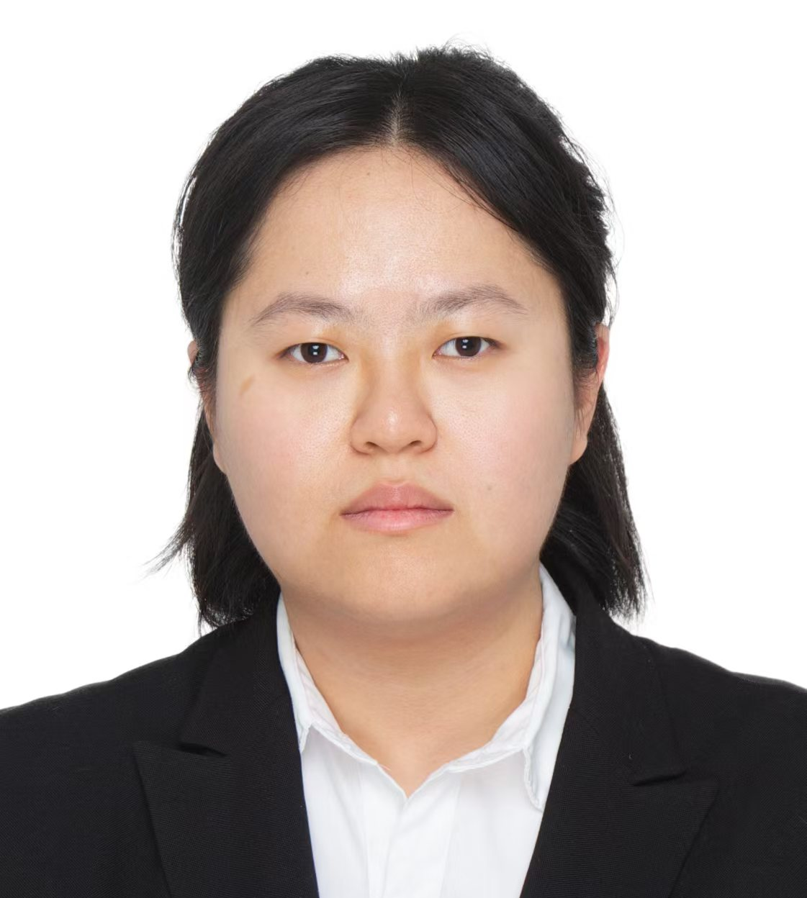

* TOC
{:toc}

***
# Professors

#### [Soo-Yol Ok](/member/sooyolok)

Soo-Yol Ok received a BSc degree in industrial engineering from Donga University, Korea in 1994, and his MSc and Ph.D. in the Institute of Information Sciences and Electronics from Tsukuba University, Japan in 1998 and 2001 respectively. He worked at the National Institute of Information and Communications Technology (NICT), a national research institute in Japan, as a senior researcher from 2001 to 2003. From 2004 to 2019 he worked as an assistant, associate, and full professor in the Department of Game Engineering at the Junior College of Information and Communication, Tongmyong University. He established the Center for Fusion and Application of Super-computing for GPU-Based Accelerated Computing at Tongmyoung University in 2013 and served as the center's director until FY 2019. In FY2016, he established the Offshore Plant O&M Engineering Simulation Center supported by the Ministry of Trade, Industry, and Energy, where he operated as the center's director until FY2019. He also served as an expert committee member for the Busan Eco Delta Smart City National Model City Development Project underway by the Ministry of Land, Infrastructure and Transport from 2018 to 2021.

He is currently working as a full professor in the Department of Computer Engineering in the College of Computer AI Engineering at Dong-A University. He also served as the Laboratory Director of the AI-Digital Twin-SW Demonstration Center at Dong-A University from 2022 to the present. He has many interests and ongoing research in digital twins, GPU-based supercomputing, and multiple inference artificial intelligence. He is the general manager of the project “Digital Twin Testbed Establishment" funded by the Ministry of Science and ICT in Korea from 2022.

###### Research Experience
* 2019 - Present: Full Professor, Dept. of Computer Engineering, Dong-A University, Busan, South Korea
* 2004 - 2019: An Assistant, Associate, and Full Professor, Dept. of Game Engineering, Junior College of Information and Communication, Tongmyong University, Busan, South Korea

###### Education
* 2001: Ph.D, Institute of Information Sciences and Electronics, Tsukuba University, Japan
* 1998: M.S, Institute of Information Sciences and Electronics, Tsukuba University, Japan
* 1994: B.S, Industrial Engineering, Dong-A University, Busan, South Korea

###### Contact
* 
* Phone: +82

#### [Suk-Hwan Lee](/member/sukhwanlee)

Suk-Hwan Lee received a B.S., an M.S., and a Ph.D. degree in Electrical Engineering from Kyungpook National University, Korea in 1999, 2001, and 2004 respectively. He worked as an assistant, associate, and full professor in the Department of Information Security at Tongmyong University from 2005 to 2019 and was the dean of the College of Software Engineering in 2019. Currently, he is a full professor in the Department of Computer Engineering at Dong-A University and has been the dean of the faculty of Computer & AI engineering at this since 2023. He has been researched in the field of multimedia security, image/video processing/compression and also digital twin platforms, AI-based computer vision, and AI security.             

He received the Achievement Award from Korea-Japan CCS (Complex Communication Society) in 2019 and best papers from KMMS (Korea Multimedia Society) in 2018, 2019 and also best lecture award from Tongmyong University in 2018, and a President Achievement Award from Dong-A University in 2023.

He has worked as a board member of IEEE R10 Busan section since 2015 and has worked as a chief editor of Korea Multimedia Society (KMMS) since 2021. He is a general manager of the project of "The Software Centered University" from 2023 and also a practice header of the project of "Digital Twin Testbed Establishment" funded by the Ministry of Science and ICT in Korea.

###### Research Experience
* 2020 - Present: Full Professor, Dept. of Computer Engineering, Dong-A University, Busan, South Korea
* 2015 - 2019: An Assistant, Associate, and Full Professor, Dept. of Information Security, Tongmyong University, Busan, South Korea

###### Education
* 2004: Ph.D, Electrical Engineering, Kyungpook National University, Deagu, South Korea
* 2001: M.S, Electrical Engineering, Kyungpook National University, Deagu, South Korea
* 1999: B.S, Electrical Engineering, Kyungpook National University, Deagu, South Korea

###### Contact
* 
* Phone: +82-51-200-7764

***
# Researchers

## Ph.D

###### [Hyeon-Cheol Kim](/member/khc) (Sep 2022 -- Present)

<table border="0">  
	<tr valign="top">
		<td width="120"></td>  
		<td>
			<ul>
				<li> Mar 2022 - Present: Ph.D, Computer Engineering, Dong-A University, Busan, South Korea</li>
				<li> Mar 2020 - Feb 2022: M.S, Computer Engineering, Dong-A University, Busan, South Korea</li>
				<li> Mar 2016 - Feb 2020: B.S, Game Engineering, Tongmyong University, Busan, South Korea</li>
				<li> Research Field: Digital twin based simulation, AI edge device</li>
				<li></li>
			</ul>
		</td>
	</tr>
</table>

###### [Sang-Hun Lee](/member/lsh) (Mar 2021 -- Present)

<table border="0">  
	<tr valign="top">
		<td width="120"></td>  
		<td>
			<ul>
				<li> Mar 2023 - Present: Ph.D, Computer Engineering, Dong-A University, Busan, South Korea</li>
				<li> Mar 2021 - Feb 2023: M.S, Computer Engineering, Dong-A University, Busan, South Korea</li>
				<li> Mar 2014 - Feb 2021: B.S, Game Engineering, Tongmyong University, Busan, South Korea</li>
				<li></li>
			</ul>
		</td>
	</tr>
</table>

###### [Phuoc-Dat Lam](/member/lpd) (Feb 2022 -- Present)

<table border="0">  
	<tr valign="top">
		<td width="120"></td>  
		<td>
			<ul>
				<li> Sep 2024 - Present: Ph.D, Computer Engineering, Dong-A University, Busan, South Korea</li>
				<li> Feb 2022 - Aug 2024: M.S, Computer Engineering, Dong-A University, Busan, South Korea</li>
				<li> Sep 2017 - Aug 2021: B.S, Computer Science, Ho Chi Minh University of Education, HCMC, Viet Nam</li>
				<li> Research Field: Smart City Ontology Domain, Data Transformation</li>
				<li></li>
			</ul>
		</td>
	</tr>
</table>

###### [Hao-Xin Lyu](/member/lhx) (Sep 2024 -- Present)

<table border="0">  
	<tr valign="top">
		<td width="120"></td>  
		<td>
			<ul>
				<li> Sep 2024 - Present: Ph.D, Computer Engineering, Dong-A University, Busan, South Korea </li>
				<li> Sep 2021 - Jun 2024: M.S, Mechanical Engineering, Dalian Polytechnic University, DaLian, China </li>
				<li> Sep 2017 - Jun 2021: B.S, Mechanical Engineering, Qilu University of Technology, ShanDong, China</li>
				<li> Research Field: Human Action Recognition</li>
				<li></li>
			</ul>
		</td>
	</tr>
</table>

## Master

###### [Bon-Hyeon Gu](/member/gbh) (Sep 2022 -- Present)

<table border="0">  
	<tr valign="top">
		<td width="120"></td>  
		<td>
			<ul>
				<li> Mar 2023 - Present: M.S, Computer Engineering, Dong-A University, Busan, South Korea</li>
				<li> Mar 2016 - Feb 2023: B.S, Computer Engineering, Dong-A University, Busan, South Korea</li>
				<li> Research Field: </li>
				<li> Website: <a href = " https://bonhyeon.9bon.org/"> https://bonhyeon.9bon.org/</a></li>
				<li> </li>
			</ul>
		</td>
	</tr>
</table>

###### [Hoang-Khanh Lam](/member/lhk) (March 2023 -- Present)

<table border="0">  
	<tr valign="top">
		<td width="120"></td>  
		<td>
			<ul>
				<li> Feb 2023 - Present: M.S, Computer Engineering, Dong-A University, Busan, South Korea</li>
				<li> Sep 2018 - Aug 2022: B.S, Computer Science, Ho Chi Minh University of Education, HCMC, Viet Nam</li>
				<li> Reseach Field: Digital Twin on Simulation, Computer Vision</li>
				<li></li>
			</ul>
		</td>
	</tr>
</table>

###### [Young-Hoon Jo](/member/jyh) (March 2023 -- Present)

<table border="0">  
	<tr valign="top">
		<td width="120"></td>  
		<td>
			<ul>
				<li> Sep 2024 - Present: M.S, Computer Engineering, Dong-A University, Busan, South Korea</li>
				<li> Feb 2021 - Aug 2024: B.S, Computer Engineering, Dong-A University, Busan, South Korea</li>
				<li> Research Field: NeRF, 3D Reconstruction</li>
				<li></li>
				<li></li>
			</ul>
		</td>
	</tr>
</table>

###### [Xing-Yi Tao](/member/txy) (Sep 2024 -- Present)

<table border="0">  
	<tr valign="top">
		<td width="120"></td>  
		<td>
			<ul>
				<li> Sep 2024 - Present: M.S, Computer Engineering, Dong-A University, Busan, South Korea </li>
				<li> Sep 2020 - Jul 2024: B.S, Information Management and Information System, Liaoning University of International Business, Liaoning, China</li>
				<li></li>
			</ul>
		</td>
	</tr>
</table>

***
## Undergraduate Research Assistants

###### [Jeon-Sik Kim (김정식)](/member/PageNotFound)
<table border="0">  
	<tr valign="top">
		<td width="120"></td>  
		<td>
			<ul>
				<li>Research Field: Autonomous-Drone, Computer Vision</li>
				<li></li>
			</ul>
		</td>
	</tr>
</table>

###### [Chae-Young Yi (이채영)](/member/PageNotFound)
<table border="0">  
	<tr valign="top">
		<td width="120"></td>  
		<td>
			<ul>
				<li>Research Field: Computer Vision(Anomaly Detection)</li>
				<li></li>
			</ul>
		</td>
	</tr>
</table>

###### [Ji-Heon Kim (김지헌)](/member/PageNotFound)
<table border="0">  
	<tr valign="top">
		<td width="120"></td>  
		<td>
			<ul>
				<li>Research Field: Computer Vision (Anomaly Detection, Audio Event Detection)</li>
				<li></li>
			</ul>
		</td>
	</tr>
</table>

###### [Ji-Hwan Bae (배지환)](/member/PageNotFound)
<table border="0">  
	<tr valign="top">
		<td width="120"></td>  
		<td>
			<ul>
				<li>Research Field: Computer Vision (Object Detection, nErf)</li>
				<li></li>
			</ul>
		</td>
	</tr>
</table>

###### [Jong-Woo Sung (성종우)](/member/PageNotFound)
<table border="0">  
	<tr valign="top">
		<td width="120"></td>  
		<td>
			<ul>
				<li>Research Field: Natural Language Processing (Multi Modal)</li>
				<li></li>
			</ul>
		</td>
	</tr>
</table>

###### [Hyeon-Jun Bea (배현준)](/member/PageNotFound)
<table border="0">  
	<tr valign="top">
		<td width="120"></td>  
		<td>
			<ul>
				<li>Research Field: Natural Language Processing (Ontology)</li>
				<li></li>
			</ul>
		</td>
	</tr>
</table>

###### [Si-Woo Jang (장시우)](/member/PageNotFound)
<table border="0">  
	<tr valign="top">
		<td width="120"></td>  
		<td>
			<ul>
				<li>Research Field: Natural Language Processing</li>
				<li></li>
			</ul>
		</td>
	</tr>
</table>

###### [Jong-Hyun Lee (이종현)](/member/PageNotFound)
<table border="0">  
	<tr valign="top">
		<td width="120"></td>  
		<td>
			<ul>
				<li>Research Field: Computer Vision (Object Detection, nErf)</li>
				<li></li>
			</ul>
		</td>
	</tr>
</table>

# Officer

###### Ms. Kim

<table border="0">  
	<tr valign="top">
		<td width="120"></td>  
		<td>
			<ul>
				<li></li>
			</ul>
		</td>
	</tr>
</table>

***
# Collaborators
* Prof. <a href="https://ieeexplore.ieee.org/author/37291154000">Ki-Ryong Kwon</a>, Pukyong National University, Busan, South Korea
