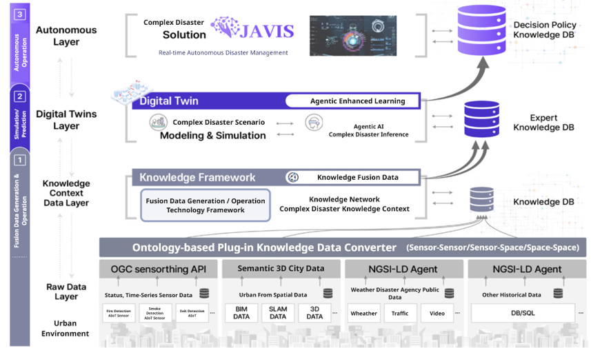
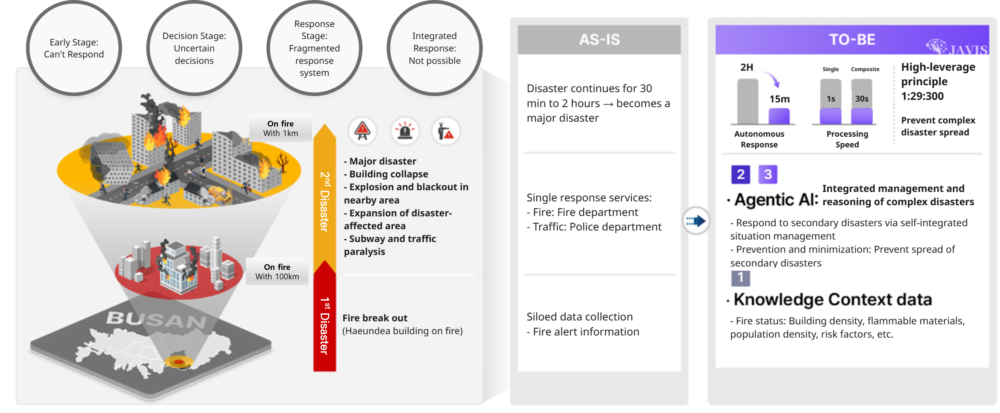

  

    <h1 class="portfolio-title">Project Timeline</h1>
    
    

      <!-- 2024 Projects -->
      

        
2024

        

          

            <h2 class="project-title">Complex Disaster Management System - JAVIS (Joint Autonomous Resilience Virtual Intelligent System)</h2>
          

          

            

              <h3>Project Information</h3>
              
A brief introduction about Project: Objectives, Content, Direction, etc. for long-term projects

            

            

              <h3>Global Partners & Collaborations</h3>
              
List of partners and collaborative university

            

            

              <h3>Development of Agentic AI - Digital Twin platform for complex disaster prediction and response</h3>
              

                
                <em>Complex Disaster Management System -JAVIS(Joint Autonomous Resilience Virtual Intelligent System)</em>
              

               
              

                
                <em>From Fragmented Response to AI-Driven Disaster Management: A Vision for Preventing Secondary Catastrophes in Urban Fires</em>
              

               
              

                
                <em>Multi-Layered AI Framework for Real-Time Disaster Prediction and Smart City Resilience</em>
              

            

            

              <h3>Acknowledgement</h3>
              
This work was supported by the Institute of Information & Communications Technology Planning & Evaluation(IITP) grant funded by the Korea government(MSIT).

            

            

              <h3>Materials</h3>
              

                

                  
2025 Digital Columbus Project - JAVIS

                  Download comprehensive project documentation
                

                

                  <a href="../researches/2025 Digital Columbus Project - JAVIS - KOR.pdf" class="download-btn korean" target="_blank">
                    📄
                    Korean
                    PDF
                  </a>
                  <a href="../researches/2025 Digital Columbus Project - JAVIS - ENG.pdf" class="download-btn english" target="_blank">
                    📄
                    English
                    PDF
                  </a>
                

              

            

          

        

      

      <!-- 2022 Projects -->
      

        
2022

        

          

            <h2 class="project-title">Digital Twin for Smart City Infrastructure</h2>
            →
          

          

             
            <iframe width="560" height="315" src="https://www.youtube.com/embed/HJqI0qVst9k?autoplay=1&mute=1" allow="autoplay"></iframe>
             
            

              <h4>Service Platform</h4>
              <ul>
                <li>The layered plug-in service platform for smart cities fosters innovation by allowing diverse cities to build and share services across public and private sectors. The platform’s architecture features a standard API that connects various digital twin-based Smart City Operating Systems (OS) across multiple cities, facilitating seamless integration of transport, government, medical, tourism, and other services. Through a unified user experience (UX), citizens benefit from consistent, accessible services regardless of location or device.</li>
                <li>The modularity of the platform enables cities to develop and test new solutions that can be horizontally scaled to other smart cities. This standardized framework maximizes the usability of core services, supporting data linkage and expanding private services while maintaining a common platform across all cities.</li>
                <li>The result is an efficient ecosystem where successful innovations can be rapidly implemented across different urban environments, accelerating the growth of smarter, more connected cities.</li>
              </ul>
              

                
                <em>Creating innovative cases of various smart cities based on a layered plug-in service platform.</em>
              

              

                
                <em>Building a Digital Twin testbed to demonstrate Smart City Lab-based services.</em>
              

            

            

              <h4>City Data Management</h4>
              <ul>
                <li>The City Database Management solution, based on 3DCityDB, imports CityGML data by reading XML schemas, converting them into schema-derived classes, and storing them in a structured database.</li>
                <li>An import worker pool resolves XLinks, processing CityGML objects into the database for efficient storage and retrieval.</li>
                <li>Once data is in 3DCityDB, it can be accessed through OGC Web Feature Service, enabling city applications to retrieve, display, and manipulate 3D city data like buildings, bridges, and transportation networks for various urban management needs.</li>
              </ul>
              

                
                <em>3D City Data - Conversion Methodology.</em>
              

              

                
                <em>3D City Data - City Database Management Solution.</em>
              

            

            

              <h4>Open Standard based IoT Ontology</h4>
              <ul>
                <li>CityGML spatial data and SensorThings API (STA) sensor data are semantically linked through RDF representations.</li>
                <li>By connecting city areas, levels, and routes with sensor observations and datastreams, the system enables bidirectional request–response interactions for enriched urban data analysis and visualization.</li>
              </ul>
              

                
                <em>Ontology Integration of CityGML and SensorThings API for Semantic Interoperability.</em>
              

              <ul>
                <li>How multisensors and smart scanners installed on smart poles collect environmental and population data across subdivided areas.</li>
                <li>The system processes the data to identify particulate concentration hotspots, assess overcrowding risks, and evaluate reference figures for optimized light source installations.</li>
              </ul>
              

                
                <em>Smart Pole Area Example with Sensor-Based Data Processing and Overcrowding Risk Analysis.</em>
              

              <ul>
                <li>The performance of the newly proposed Digital Twin ontology based on the OGC SensorThings API, a quantitative assessment is performed.</li>
              </ul>
              

                
                <em>Ontology Visualization and Quantitative Evaluation of STA and TSC Ontologies.</em>
              

            

            

              <h4>Acknowledgement</h4>
              
This work was supported by Institute for Information & communications Technology Promotion(IITP) grant funded by the Korea government(MSIP) (No.2022-0-00622, Digital Twin Testbed Establishment).

            

          

        

      

    

  

<!-- ########################################### Start the 2022 ~ 2024 ########################################### -->
<!-- # May 2025 ~ Present

  

    

        
        

          

            

                <a class="article__tag">Digital Twin</a>
            

          

          <h2 class="article__title">
            <a href="/research/JAVIS">Complex Disaster Management System - JAVIS (Joint Autonomous Resilience Virtual Intelligent System)</a>
          </h2>
          
🌐Development of a hierarchical agentic AI-based digital twin platform for complex disaster prediction and response.

          

            

              <time datetime="2025-05-01T00:00:00+09:00">2025 ~ Present</time>
            

            <a href="/research/JAVIS" class="read-more">Keep Reading <i class="ion ion-ios-arrow-forward"></i></a>
          

        

      

  

 -->
<!-- ########################################### End the 2025 ~ Present ########################################### -->

***

<!-- ########################################### Start the 2022 ~ 2024 ########################################### -->
<!-- # Apr 2022 ~ Dec 2025

  

    

        
        

          

            

                <a class="article__tag">Digital Twin</a>
            

          

          <h2 class="article__title">
            <a href="/research/digital-twin-smart-city">Digital Twin for Smart City</a>
          </h2>
          
🌐The integration of Digital Twin technology in Busan's Eco Delta Smart City exemplifies a forward-thinking approach to urban development, aiming to enhance quality of life while promoting environmental sustainability.

          

            

              <time datetime="2022-04-1T00:00:00+09:00">April 1, 2022 ~ December 31, 2025</time>
            

            <a href="/research/digital-twin-smart-city" class="read-more">Keep Reading <i class="ion ion-ios-arrow-forward"></i></a>
          

        

      

  

 -->
<!-- ########################################### End the 2022 ~ 2024 ########################################### -->