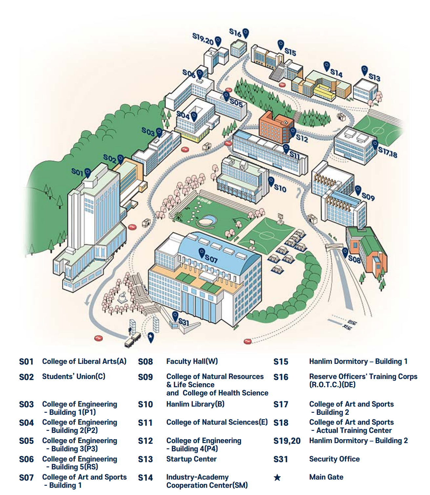

***
### Address

<table >
  <tr>
    <th>Prof.Lee</th>
    <th>Prof.Lee</th>
    <th>Laboratory & Office</th>
  </tr>
  <tr>
     <td>
			<ul>
				<li> room</li>
				<li> [email](mailto:john@john.com)</li>
			</ul>
		</td>
    <td>
			<ul>
				<li> room</li>
				<li> [email](mailto:john@john.com)</li>
			</ul>
		</td>
    <td>
			<ul>
				<li> room</li>
			</ul>
		</td>
  </tr>
</table>

  

    <iframe src="https://www.google.com/maps/embed?pb=!1m18!1m12!1m3!1d203.97736381294206!2d128.96626538718166!3d35.115753622004185!2m3!1f0!2f0!3f0!3m2!1i1024!2i768!4f13.1!3m3!1m2!1s0x3568c25d14c1764f%3A0x9f345b4d72a391e7!2sDong-a%20University%2C%20Seunghak%20Campus!5e0!3m2!1sen!2skr!4v1727409212799!5m2!1sen!2skr" width="1000" height="600" style="border:0;" allowfullscreen="" loading="lazy" referrerpolicy="no-referrer-when-downgrade"></iframe>
  

 

* S03-0213, 37 Nakdong-daero 550beon-gil, Saha-gu, Busan, Korea
  
***

### E-mails 

* [John](mailto:john@john.com)

***
### Phones

* [John](tel:2223334567)
