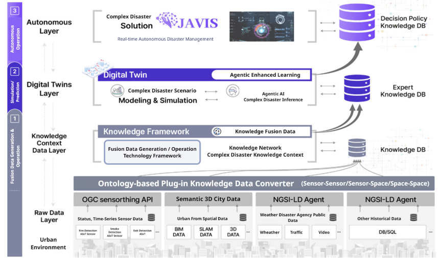
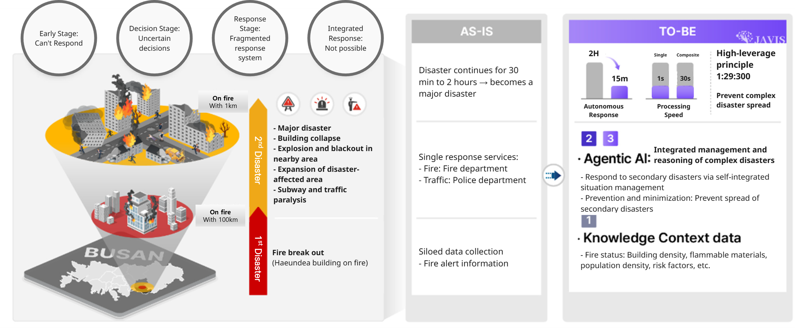
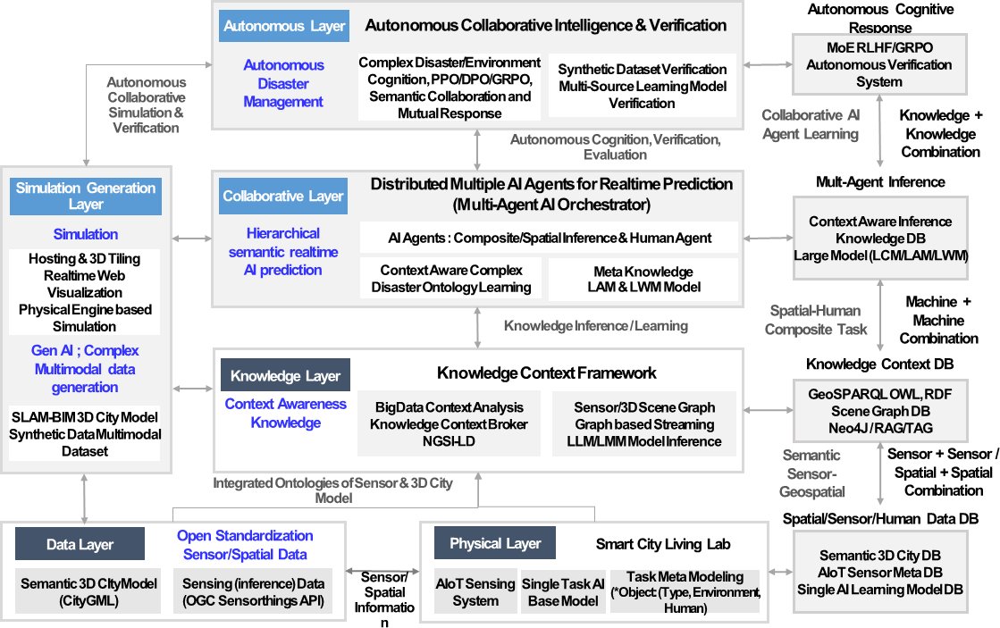

* TOC
{:toc}

***

# Development of a hierarchical agentic AI - digital twin platform for complex disaster prediction and response 

  
  <em>Complex Disaster Management System -JAVIS(Joint Autonomous Resilience Virtual Intelligent System)</em>

 

  
  <em>From Fragmented Response to AI-Driven Disaster Management: A Vision for Preventing Secondary Catastrophes in Urban Fires</em>

 

  
  <em>Multi-Layered AI Framework for Real-Time Disaster Prediction and Smart City Resilience</em>

# Materials

- [📄 2025 Digital Columbus Project - JAVIS - KOR](../researches/2025 Digital Columbus Project - JAVIS - KOR.pdf)
- [📄 2025 Digital Columbus Project - JAVIS - ENG](../researches/2025 Digital Columbus Project - JAVIS - ENG.pdf)