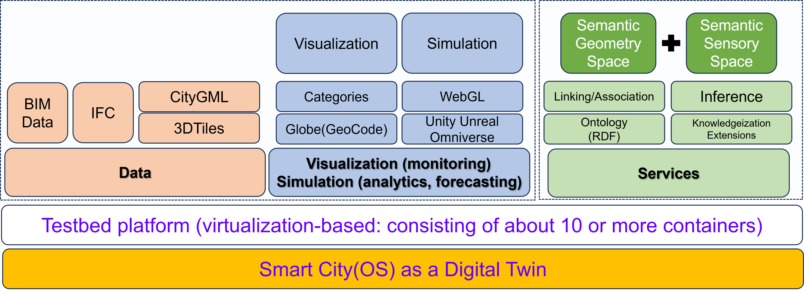

* TOC
{:toc}

***

# Smart City Project 

<!-- 

    <video width="1000px" height="500px" title="Smart City" autoplays muted controls>
      <source src="https://dongaackr-my.sharepoint.com/personal/2371049_donga_ac_kr/_layouts/15/embed.aspx?UniqueId=ede8ff0e-c716-4f0d-8e63-6ad99bae6e89&embed=%7B%22af%22%3Atrue%2C%22ust%22%3Atrue%7D&referrer=StreamWebApp&referrerScenario=EmbedDialog.Create" type="video/mp4">
    </video>

 -->

<iframe src="https://dongaackr-my.sharepoint.com/personal/2371049_donga_ac_kr/_layouts/15/embed.aspx?UniqueId=ede8ff0e-c716-4f0d-8e63-6ad99bae6e89&embed=%7B%22af%22%3Atrue%2C%22ust%22%3Atrue%7D&referrer=StreamWebApp&referrerScenario=EmbedDialog.Create" width="1000" height="500" frameborder="0" scrolling="no" allowfullscreen title="SmartCity_v3.mp4" style="border:none; position: absolute; top: 0; left: 0; right: 0; bottom: 0; height: 100%; max-width: 100%;"></iframe>

Service Platform
--------------------

* The layered plug-in service platform for smart cities fosters innovation by allowing diverse cities to build and share services across public and private sectors. The platform's architecture features a standard API that connects various digital twin-based Smart City Operating Systems (OS) across multiple cities, facilitating seamless integration of transport, government, medical, tourism, and other services. Through a unified user experience (UX), citizens benefit from consistent, accessible services regardless of location or device.
  
* The modularity of the platform enables cities to develop and test new solutions that can be horizontally scaled to other smart cities. This standardized framework maximizes the usability of core services, supporting data linkage and expanding private services while maintaining a common platform across all cities. 
  
* The result is an efficient ecosystem where successful innovations can be rapidly implemented across different urban environments, accelerating the growth of smarter, more connected cities.

  
  <em>Creating innovative cases of various smart cities based on a layered plug-in service platform.</em>

  
  <em>Building a Digital Twin testbed to demonstrate Smart City Lab-based services.</em>

City Data Management
--------------------

*

  
  <em>3D City Data - Conversion Methodology.</em>

* The City Database Management solution, based on 3DCityDB, imports CityGML data by reading XML schemas, converting them into schema-derived classes, and storing them in a structured database. 
* An import worker pool resolves XLinks, processing CityGML objects into the database for efficient storage and retrieval. 
* Once data is in 3DCityDB, it can be accessed through OGC Web Feature Service, enabling city applications to retrieve, display, and manipulate 3D city data like buildings, bridges, and transportation networks for various urban management needs.

  
  <em>3D City Data - City Database Management Solution.</em>

